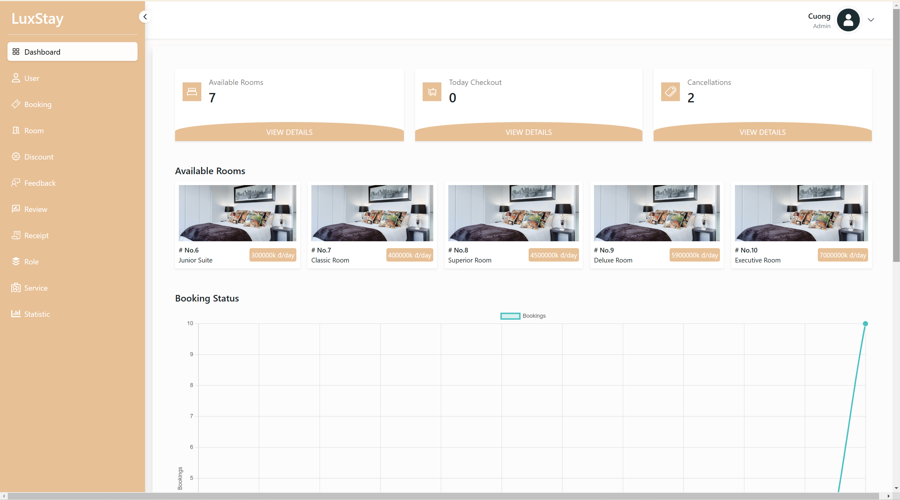
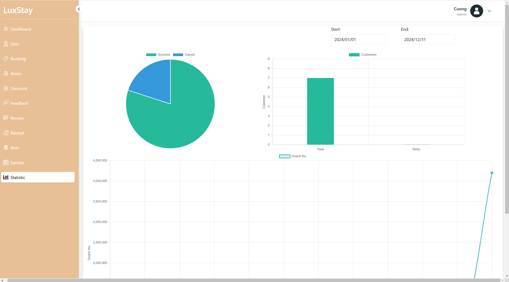
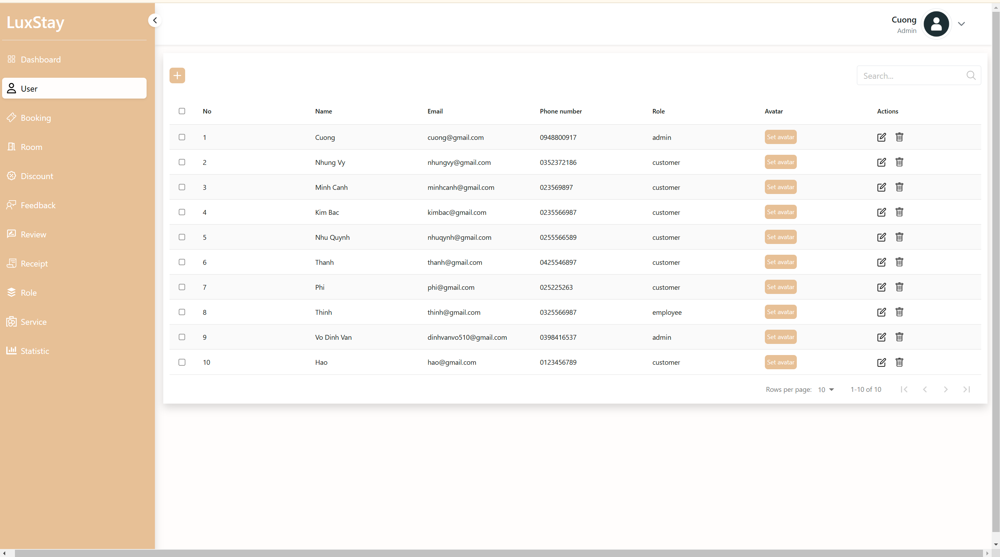
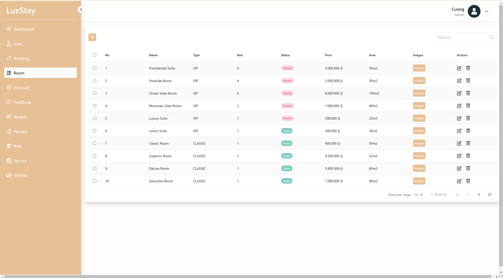
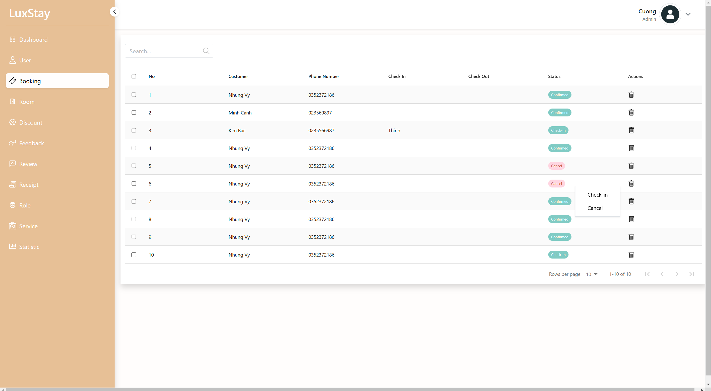
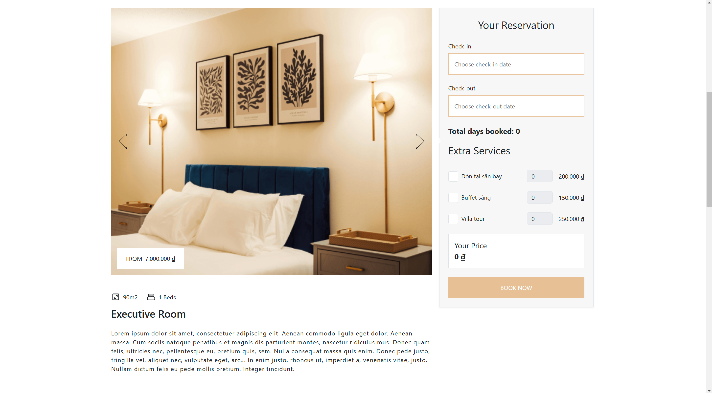
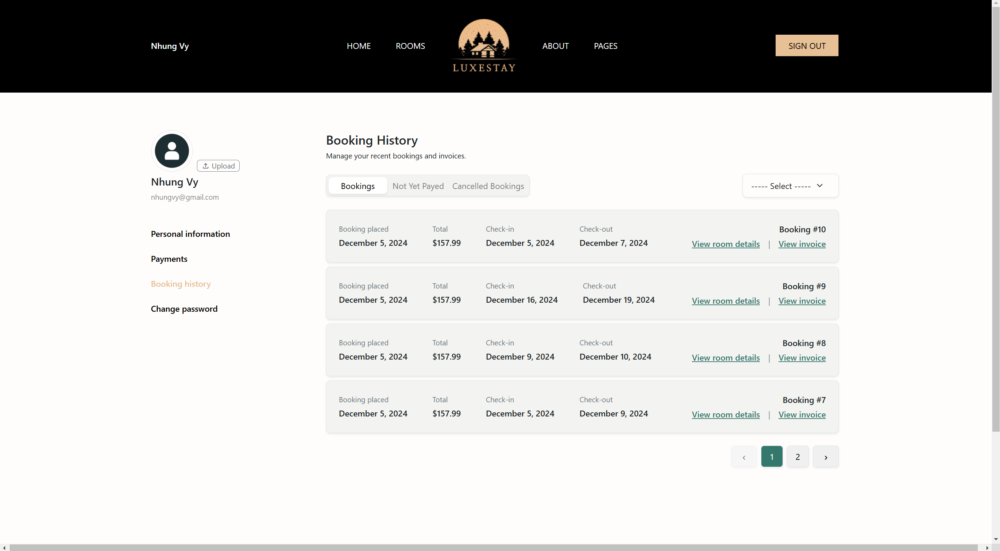

Nhóm 15: Xây dựng website quản lý khách sạn.

# Mục tiêu

Xây dựng nền tảng trực tuyến đơn giản, thuận tiện để khách hàng dễ dàng tìm kiếm và đặt phòng khách sạn.

# Công nghệ sử dụng

- Frontend: ReactJS
- Backend: ASP.NET core MVC
- Database: MySQL
- Security: JWT

# Các chức năng chính

- Tìm kím và đặt phòng trực tuyến
- Quản lý thông tin phòng
- Hệ thống thanh toán tích hợp VNPAY
- Quản lý đơn đặt và quản lý người dùng
- Thống kê doanh thu

# Chạy dự án

Yêu cầu:

- ASP.NET core MVC version 8.0.2 or later
- npm installed

Cài đặt:

1. Clone project
```bash
# Include Backend, Frontend
git clone https://github.com/giacuong333/hotel-management.git


```
2.Thay đổi connectionString trong appsettings.json
```json

"ConnectionStrings": {
    "Connection": "Data Source=[YOUR_SERVER_NAME];Initial Catalog=MutiFashion;Integrated Security=True;Encrypt=True;Trust Server Certificate=True"
  }
```
3.Cập nhật cơ sở dữ liệu
```bash
dotnet ef database update

```
4.Cài đặt các package 
-Open Terminal trong frontend
```bash
npm i

```
-Open Terminal trong backend
```bash
dotnet build

```
5. Chạy Dự Án:
-Open Terminal trong frontend
```bash
npm start

```
-Open Terminal trong backend
```bash
dotnet run

```

# Demo

Admin Dashboard


Statistic


User Management


Room Management


Booking Management


Home Page


Room Details Page


User Booking History


# Thành viên

- Lê Gia Cường
- Hoàng Nhật Hào
- Phạm Minh Trung
- Võ Đình Văn
